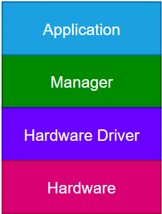
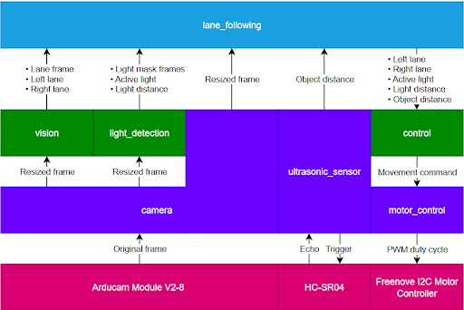
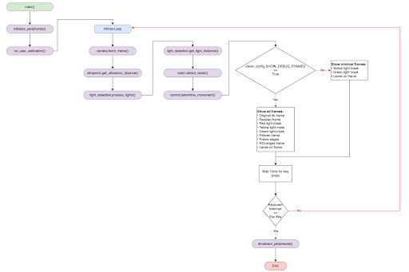

# ADAS Lane Keeping Robotic Car
By: George Trupiano

Class: ECE-6520

---

## Purpose of Project
This project is about understanding, designing, and implementing a simplified Advanced Driver Assistance System (ADAS) using a Raspberry Pi 5, a camera, and an ultrasonic sensor. The purpose of this system is to simulate real-time vehicle assistance features such as lane detection, traffic light detection, object detection, and basic movement control in order to replicate how a vehicle interprets and reacts to its surrounding environment. The system follows a structured approach where all peripherals are initialized, the region of interest (ROI) is calibrated, and then the application continuously loops through capturing sensor data, processing that data, and applying control logic as described in the system flow diagrams.

Visual data is obtained from the camera and processed to detect lanes and traffic lights using image processing techniques such as grayscale conversion, edge detection, and HSV masking. Distance measurements are obtained from the ultrasonic sensor and filtered using an exponential moving average (EMA) to reduce the effect of noisy readings. That filtered data, along with detected lane positions and traffic light states, is used within a priority-based control system to determine how the robotic car should move. The system adjusts motor behavior based on object distance, traffic light conditions, and lane position using predefined thresholds and proportional logic.

The results show the ability of the system to make real-time decisions by integrating multiple sensor inputs and processing stages. This demonstrates a simplified yet effective approach to ADAS implementation while highlighting concepts such as sensor fusion, real-time processing, and modular system design without relying on more advanced control methods such as PID.

[Here](https://youtu.be/Yv7g_DVL-VA) is the demo video for this project.
It is also present in the repository [here](./Documentation/Comprehensive_IPR_Demo_Video.mp4)

---
 

## System Architecture Explained
For the actual design of the software, the code is split into modules. Depending on the level that it interfaces with the system (directly controlling GPIO pins vs application level logic) dictates what layer they are present in.

### Layer Definition

**Application:** Holds the main logic which interfaces with all other layers to execute the main features of the system.\
**Manager:** Contains feature level logic and handles interfacing with lower level logic to actually execute intended behavior.\
**Hardware Driver:** Contains logic that directly interfaces with the hardware.
  

### System Interface Diagram
This diagram describes how the different components interact with each other.

  

---

## Code Explaination
This is just an overview of the program logic for all of the modules and features present within the system architecture. A more detailed explaination of each function is present within the project report which can be found [here](./Documentation/ECE_6520_Term_Project.pdf)

### Application Logic
This function implements the overall application logic by using modules within the system in order to execute the required features. It configures all peripherals and allows users to calibrate the ROI. Then it loops over each frame and does the following sequence: capture peripheral data (camera, ultrasonic), execute image processing (detecting lanes, lights), commanding the robot to move properly based on the processed data, and showing the resulting data on the camera feed (lanes, lights).

#### Flow Diagram

  

---

## Conclusion of Project

This project successfully implements a simplified Advanced Driver Assistance System (ADAS) using a Raspberry Pi 5, a camera, and an ultrasonic sensor. By using a modular architecture and a structured application flow, the system is able to capture sensor data, process visual information, and apply control logic to determine the movement of the robotic car. The overall approach follows the sequence shown in the application logic and flow diagrams, where the system initializes peripherals, allows ROI calibration, continuously captures camera and ultrasonic data, processes that data for lane and light detection, and then commands the motors accordingly.

The system uses techniques such as exponential moving average (EMA) filtering for both distance measurements and visual data smoothing, HSV-based color detection for traffic lights, and interpolation for estimating distance based on detected light area. The control logic is implemented using a priority-based approach where object detection, traffic light response, and lane keeping are handled in sequence. This allows the system to respond appropriately to different conditions such as stopping at red lights, slowing for yellow lights, and maintaining position within detected lanes.

While the system performs effectively in a controlled environment, there are limitations when considering real-world applications. These include sensitivity to lighting conditions, reliance on fixed HSV thresholds, and assumptions made in lane detection and distance estimation. Additionally, the lack of more advanced control methods such as PID or sensor fusion limits robustness in dynamic environments. Despite these limitations, the project demonstrates key concepts such as modular system design, real-time processing, sensor integration, and decision-based control logic, which are all fundamental to modern ADAS implementations.