# ADAS Lane Keeping Robotic Car
By: George Trupiano

Class: ECE-6520

---

## Purpose of Project
This project is about understanding, designing, and implementing a simplified Advanced Driver Assistance System (ADAS) using a Raspberry Pi 5, a camera, and an ultrasonic sensor. The purpose of this system is to simulate real-time vehicle assistance features such as lane detection, traffic light detection, object detection, and basic movement control in order to replicate how a vehicle interprets and reacts to its surrounding environment. The system follows a structured approach where all peripherals are initialized, the region of interest (ROI) is calibrated, and then the application continuously loops through capturing sensor data, processing that data, and applying control logic as described in the system flow diagrams .

Visual data is obtained from the camera and processed to detect lanes and traffic lights using image processing techniques such as grayscale conversion, edge detection, and HSV masking. Distance measurements are obtained from the ultrasonic sensor and filtered using an exponential moving average (EMA) to reduce the effect of noisy readings. That filtered data, along with detected lane positions and traffic light states, is used within a priority-based control system to determine how the robotic car should move. The system adjusts motor behavior based on object distance, traffic light conditions, and lane position using predefined thresholds and proportional logic.

The results show the ability of the system to make real-time decisions by integrating multiple sensor inputs and processing stages. This demonstrates a simplified yet effective approach to ADAS implementation while highlighting concepts such as sensor fusion, real-time processing, and modular system design without relying on more advanced control methods such as PID.

---
 

## System Architecture Explained
For the actual design of the software, the code is split into modules. Depending on the level that it interfaces with the system (directly controlling GPIO pins vs application level logic) dictates what layer they are present in.

### Layer Definition

**Application:** Holds the main logic which interfaces with all other layers to execute the main features of the system.\
**Manager:** Contains feature level logic and handles interfacing with lower level logic to actually execute intended behavior.\
**Hardware Driver:** Contains logic that directly interfaces with the hardware.
  

### System Interface Diagram
This diagram describes how the different components interact with each other.

  

---

## Code Explanation
This is a detailed overview of the program logic for all of the modules and features present within the system architecture.

### Application Logic
This function implements the overall application logic by using modules within the system in order to execute the required features. It configures all peripherals and allows users to calibrate the ROI. Then it loops over each frame and does the following sequence: capture peripheral data (camera, ultrasonic), execute image processing (detecting lanes, lights), commanding the robot to move properly based on the processed data, and showing the resulting data on the camera feed (lanes, lights).

#### Flow Diagram

  

### Initialization Functionality
The initialization function configures all peripherals used in the system. These include the ultrasonic sensor, camera, and motor controller. Each peripheral is configured with the required settings and default parameters to operate within the system.

#### Flow Diagram
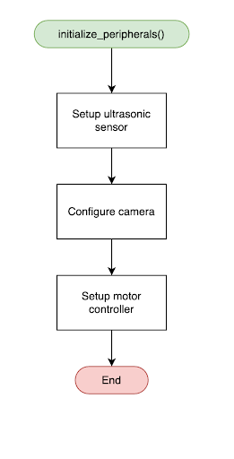
  

### ROI Calibration Startup Flow:
The feature allows the user to dynamically change the ROI points before the main system starts up using a GUI. By displaying the camera feed and applying the ROI, it allows the user to see what ROI points would be optimal for the current robot setup. If the camera had changed height or angle for example, the ROI would need to be reconfigured which this would assist with.

#### Flow Diagram
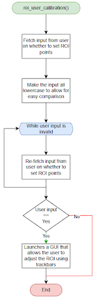
  

### Camera Frame Capturing
This module handles interfacing with the camera module. The module captures the raw frame from the camera and verifies that it exists before proceeding with any image processing. Originally, the camera defaults to outputting a 3840 x 2160 image. Due to the size, the speed at which the Raspberry Pi can process each frame is impacted significantly. As a result of this, once the raw frame is captured, that frame is then resized to a lower resolution of 640x480 to keep up a fast processing speed.

#### Flow Diagram
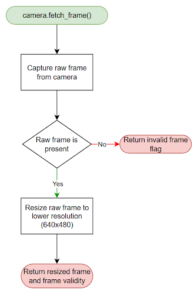
  

### Ultrasonic Sensor Data Capturing
This module handles interfacing with the ultrasonic sensor. The module obtains distance from the ultrasonic sensor and applies an exponential moving average to the raw distance reading from the sensor. By doing this, it allows the sensor reading to be smoothed for more decisive behavior.

#### Equation
zNew Running Average = (α * xinstantaneous​) + ((1 − α) * yprevious average​)

What this calculation allows is to control the amount of impact the new instantaneous value has on the running average.

#### Flow Diagram
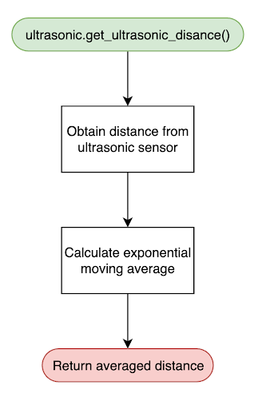
  

### Traffic Light Detection
The light detection module uses predefined HSV ranges for each color (red, yellow, and green) and applies those masks to the frame. Based on which mask yields results with the proper area constraints, a bounding box is drawn on the detected light and text with the detected light is displayed. It will also return the area for use later for distance calculation.

#### Flow Diagram
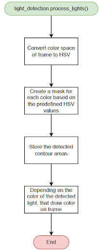
  

### Traffic Light Distance Estimation
The same light detection module handles determining which light is actively being detected as well as calculating the distance of the detected light. Determines the active light based on which color is detected. Then using the same approach for averaging the lanes, an exponential moving average is used on the detected light area. For determining the distance the light is from the car, a calibration table is used. Since the area doesn’t scale with distance linearly, a different approach needed to be used. By mapping the area of each colored light to a real world distance for multiple points, piecewise interpolation can be used. This makes it so the math is always simpler linear interpolation even on a set of data that isn’t linear. Points needed to be created at multiple distances for each color to get accurate results.

#### Flow Diagram
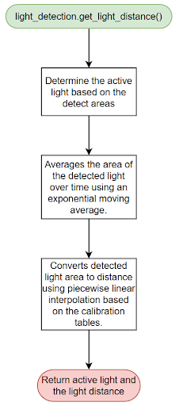
  

### Lane Detection
This module is in charge of detecting both the left and right lanes present within the frame. With those lanes detected, they are then drawn onto the original frame. The way it actually detects the lanes is with the algorithm described in the flow chart below.

#### Flow Diagram
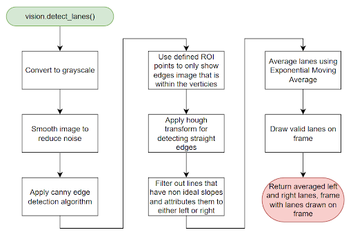
  

### Movement / Control Logic
This module is in charge of determining how the car should move based on the information collected during the image processing stages including (left and right lane coordinates, active light, light distance, and object distance). The control logic follows a priority based system which is:

#### Object Detection
The ultrasonic sensor is used to determine whether there is an obstacle blocking the path of the robot.

##### Object Detection Flow Diagram
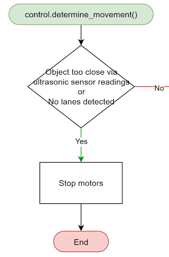
  

#### Traffic Light Response
The system responds differently based on which light it is currently detecting.
- When a red light is detected, the system checks to see if the robot is too close. If it is then the motors are commanded to stop.
- When a yellow light is detected, the system modifies the base PWM values for speed control to be significantly slower. The system will then proceed to the lane keeping logic with the modified PWM values.
- When a green light is detected, the system will proceed as normal to the lane keeping logic

##### Traffic Light Flow Diagram
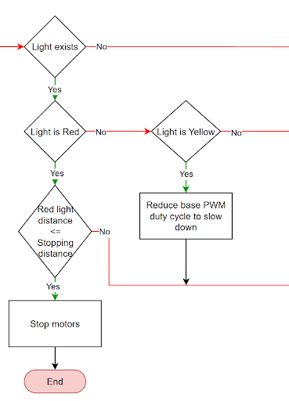
  

#### Lane Keeping
The system will attempt to keep the robot within the two detected lanes. There is an edge case that is important to address before determining how to keep the robot within the two lanes. An important edge case occurs when only one of the two lanes is detected. This was solved by having the robot do an arc turn at a set PWM duty cycle to the left or the right based on which lane was missing. By doing this, it should allow the robot to see both lanes. Now the system is allowed to proceed with the lane keeping logic. The approach is calculating the difference between the frame center and the lane center. Based on that error, the PWM duty cycle of the left or the right wheel is mapped to the error. Whether the error is mapped to the left or the right wheels is based on the sign of the error. With a negative error, the left wheels PWM duty cycle will be mapped to the error. Likewise, a positive error will map the error to the PWM duty cycle of the right wheels.

##### Lane Keeping Flow Diagram
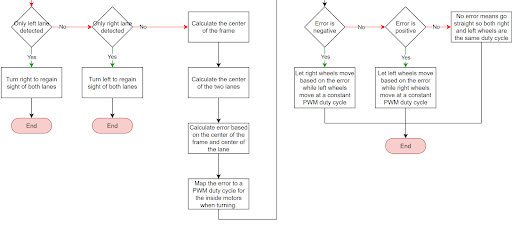

#### Full Flow Diagram
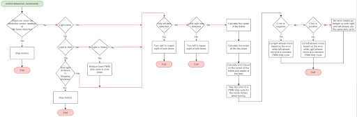
  

### Shutdown Procedure
The shutdown function properly releases control of all peripherals so they will be set to a safe state before the program closes. This is done for the ultrasonic sensor, camera, motor controller, and OpenCV windows.

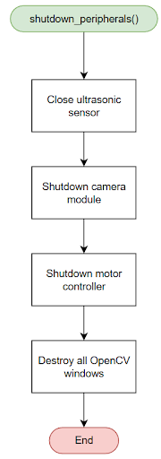

---

## Conclusion of Project

This project successfully implements a simplified Advanced Driver Assistance System (ADAS) using a Raspberry Pi 5, a camera, and an ultrasonic sensor. By using a modular architecture and a structured application flow, the system is able to capture sensor data, process visual information, and apply control logic to determine the movement of the robotic car. The overall approach follows the sequence shown in the application logic and flow diagrams, where the system initializes peripherals, allows ROI calibration, continuously captures camera and ultrasonic data, processes that data for lane and light detection, and then commands the motors accordingly.

The system uses techniques such as exponential moving average (EMA) filtering for both distance measurements and visual data smoothing, HSV-based color detection for traffic lights, and interpolation for estimating distance based on detected light area. The control logic is implemented using a priority-based approach where object detection, traffic light response, and lane keeping are handled in sequence. This allows the system to respond appropriately to different conditions such as stopping at red lights, slowing for yellow lights, and maintaining position within detected lanes.

While the system performs effectively in a controlled environment, there are limitations when considering real-world applications. These include sensitivity to lighting conditions, reliance on fixed HSV thresholds, and assumptions made in lane detection and distance estimation. Additionally, the lack of more advanced control methods such as PID or sensor fusion limits robustness in dynamic environments. Despite these limitations, the project demonstrates key concepts such as modular system design, real-time processing, sensor integration, and decision-based control logic, which are all fundamental to modern ADAS implementations.